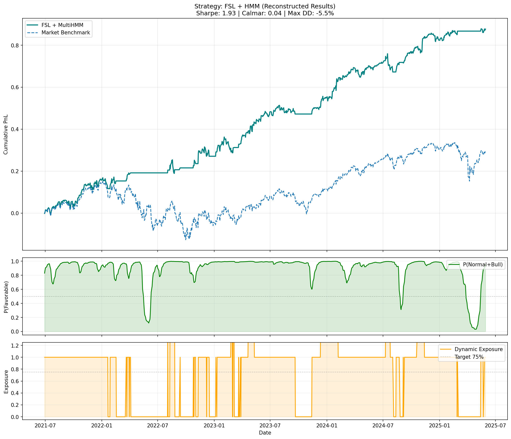

# Hierarchical Sheaf Networks & Topological HMM

#Alpha 1.0.3 : Reducing complexity with multi-head latent space

Implementing Sheaf Neural Networks with HMM to model market as a dynamic topological structure. We use structural coherence (Cohomology $H¹$) as alpha signal.

1. Why cohomology ?
    We don't use homology, because there isn't a cup product -> better structure.
    So why $H¹$ instead of other cohomology space $H^k$ ?
    $H⁰$ is the "Beta". When everything goes up, $H⁰$ is high. Bad for alpha.
    $H¹$ is the obstruction to global coherence. Locally, the cycles run, but globally, we get an impossible cycle -> anomaly (structural "stress")
    $H²$ is superior order incoherence. Hard to interpret, and it takes a lot of computational workload ($O(N³)$) !

    So we have our $H¹$, the cohomology score, an indicator of structural (systemic) stress.
    When :
        1) $H¹\approx 0$ -> Coherent market (cycles are stable)
        2) $H¹ >> 0$ -> Incoherent market (cycles are distorted)

    So let's use $H¹$ instead of volatility to find the right regime !
    Well... Not exactly. H¹ alone has problems : in a global crisis, the market is structured. So it falls with it. To solve this problem, we add volatility : We use a composite signal (H1 modulated by volatility) to detect regimes. High volatility increase structural stress, so the model can distinguish 'calm coherence' (Bull) and 'crash coherence' (Bear)."

2. Why HMM ?
    Unlike usual methods, we don't use Hidden Markov Models to predict future prices : we use it to analyse the structural quality with $H¹$. The regimes are the hidden states. Here, there is 4 regimes : Bull ($H¹$ low), Normal ($H¹$ medium), Volatil ($H¹$ high), Crisis ($H¹$ very high). Be aware that these states are not particularily the market states : it only indicates the coherence of the market. So Bull state is a high-correlated market. Unlike standard HMMs, we add a Trend Filter (Moving Average) and Realized Volatility. This avoids the 'Structural Trap' described earlier where the model falls with a (coherent) structural crash.

    Also, in HMM, we implemented inertia to avoid that the model changes too fast of opinion (avoid whipsaw). The HMM is also useful to change some investment parameters like leverage, long/short, etc.

3. Why Functorial Sheaf Learning ?
    Unlike other models, Sheaf Neural Network uses linear applications to explain different states. This is used to model more complex relations, and to explain them ! We can invert, rotate, unphase, linear applications ! It gives the keys to translate APPL to MSFT (sort of), instead of only showing the correlation (like GNN or smth else).

    The functorial part is useful to keep the topological structure between layers. In classical neural networks, geometrical structure is sometimes lost between the layers. So the functorial part is useful to keep the structural interpretability !

## Architecture

### Hierarchical Forecasting

Deep Neural Network to learn topology of the market

1) (Multi-Head) Factorized Sheaf Laplacian (to keep "FSL") : In the last version, I used Dynamic Sheaf Laplacian with attention matrix. The problem was the $O(N^2 \cdot d^2)$ complexity. So I've implemented a new architecture in $O(N\cdot d^2 \cdot k)$, with $N$ the number of assets, $d$ the feature dimension, and $k$ the number of heads. This method uses linear attention (but non-linear projectors) and $k$ latent space projections. The point here is that we project assets into $k$ independent latent space with $d_{latent} << d_{input}$. Why $k$ ? Because with 1 latent space, we could lose the main goal of $H^1$ : link structures (because with a single latent space : A->B and B->C would say that there is a link A->C). So interactions are now modeled with $N$ projectors and $N$ de-projectors (forcing model to learn low-rank representation of market topology). But a reduction of complexity always comes at a cost. Without the genius $N\times N$ matrix, the model now has difficulties to understand highly complex "links" between assets. So maybe it'll need tuning in the future. I will try to analyzes how it scales, and at which point this complex information we lost was useful in the model.
2) Multi-scale U-Net : Micro/Macro - local volatility and global tendancy using Restrictions and Extensions (to detail more)
3) Topology Consistency ($H¹$) : Measure at which point the assets movements are "coherents" with the learned structure. High $H¹$ indicates an anomaly in the structure.

### Training

Try to separate signal and noise using

Structural Triplet Loss : Learn what is anchor (healthy market) or positive (noisy market) and negative (total chaos)

Try to optimize directional prediction (Sign Loss), ranking and signal reconstruction.

### HMM and Adaptive parameters

1) Regime detection : using HMM to predict regime (Normal, Bull, Volatil, Crisis) on a vol-adjusted topological signal $H¹\times (1+\sigma)$. This ensures that if the market structure is coherent (high H¹), a spike in vol will force HMM into defensive state.
2) Trading rules change with time : leverage, long/short, etc. change with the regime.

### Transformers and LSTM comparison

The nice thing about FSL is that the model "knows" if he's right or not : we have structural confidence from the model with $H¹$ (structural problem or not !). It knows when not to invest (and it's sure -or not- about it!). But we need to see the limits of this : after a certain threshold of noise, the model doesn't know when he's sure or not. Moreover, with bad learning, he's sure but about bad things ! So these steps are highly important.

Here, using LSTM is bad because it is difficult to find links between assets, and if the market has a regime change, it fails to adapt quickly. Of course, there exists some adjustments but fundamentally, there is a problem.

Using Transformers here would be hard too, because the transformer would see correlation everywhere, and will hallucinate relations between assets. Moreover, it needs tremendous amount of data to learn !

Here FSL is native multi-assets : the model *is* the graph of relations. Moreover, Transformers and LSTM are black boxes. FSL can be interpreted, we can analyse it's structure and see what goes right/wrong in the market. Additionally, with Sheaf Learning, we prevent the model to learn from bad data. But the thing is that we have a strong assumption : the markets tends to an equilibrium (stable).

## Additional Notes

We can note that FSL has similar performance when we vary the seed of randomness. Nice !

## To go further

The goal is to apply FSL in more domains, notably in medical predictions data.

### Problems and possible solutions

1) Major problem : survivor bias. BUT ! With the new complexity, I can try it on more tickers, probably all the S&P500 ! (need to test it)
2) Hard-Coded Gating -> use soft gating or continuous transfer function?
3) Adaptive Parameters using percentiles instead of values
4) Non-stationarity of $H¹$ : Fix means in HMM to define regimes. Need to update that slowly (So that if the market structurally change, the model learns it). For now, we define Crisis based on high quantiles of the H1 distribution.
5) No fees of trading.
6) Survivor bias (we have the S&P500 (16 tickers) on assets that performed really well these last years)
7) [SOLVED] Hard scalability on large number of assets (N² restriction matrices). Complexity of $O(N²)$. Here we have 256 matrices (16²). S&P500 : ~250,000 !! We use Multi-head now.
8) Perpetual fight against trivial collapse, with spectral regularization. For now I don't have this problem, but maybe need to optimize it.
9) Bad in fast crash (lag of HMM)
10) With M&A, bad ! -> MSFT acquires Activision. Activision will be uncorrelated from the market to align with MSFT. $H¹$ is high and detect risk and shout the crisis.
11) [SOLVED] Complexity ($O(N²*D²)$ with N number of asset pairs and D feature dimension). Really bad for scaling... Transformer : $O(N²\cdot D)$. A possible solution (need to confirm it with results) would be to restraint assets to "talk" with only it's k neighbors : $O(N\cdot k\cdot D²)$, more viable.
12) Better README file (finalize using latex for formulas etc) and better in-detail explanations

### Improvements

1) Learnable Residual Weights
2) [REMOVED] Diagonal in adjacency matrix is $-10^9$ (temporary solution with the Diffusion Matrix, try to test Normalized Laplacian ?)
3) [REMOVED] Maybe interesting to see $H²$, but at the price of interpretability -> dimensionality reduction ? what performance with $H²$ ? Are the links between assets sooo complex in real life ? Also complexity ($O(N^3)$) -> Using hypergraph to capture collective (sector) behavior -> Sheaf Hypergraph Networks (lighter than $H²$ computation). This is removed as we try to reduce complexity. The H¹ is sufficient enough to capture complex relations ($H²$ would be too slow for a not-so-much improvement).
4) [DONE] Complexity reduction. Initially, I considered low-rank factorization, but this was bad because we lost the main interest of $H¹$. Switched to Multi-Head Latent Space to preserve topology while maintaining $O(N\cdot d^2 \cdot k)$ complexity.
5) Ollivier-Ricci curvature. Seen on a video, measures congestion. Need to dig that, would be interesting. Small explanation : in crisis, everyone rush on safe-assets (topological congestion). We could inject the curvature as a new feature in the HMM besides $H¹$ ?
6) Martin Hairer (Fields, 2014) : Path Signatures to FSLPredictor instead of gross return ?
7) Interesting thing I've seen too on HMM (from LSM Investment Club) : Hierarchical Dirichlet Process (HDP) ! For now, we hardcode the number of hidden states (Bull, Normal, Volatil, Crisis). But is this right ? -> HDP learns the number of necessary states !
8) Adversarial Training (ML course, LELEC2870). Interesting to apply it here ?
9) RL for leverage (for now, if("BULL"): leverage=1.5) to learn what is the best one. See paper on RL in finance (PPO agent);
10) Vectorize cycles computing (better use on GPU)
11) Scheduler on train (I have 10 epochs now but in the future).

## Results

In this version, we get these results :

Tickers :
        "AAPL", "MSFT", "NVDA", "AMZN", "GOOGL", "JPM", "BAC", "XOM", "CVX", "JNJ", "PFE", "PG", "KO", "MCD", "HD", "DIS"
Train on 2010-01-01 to 2018-12-31
Test on 2019-01-01 to 2025-01-01

PERFORMANCE:
  FSL+HMM Strategy: Sharpe=1.93, Return=87.66%
  Max Drawdown: -5.51%

REGIME DISTRIBUTION:
  • Normal (Conviction)   :  59.1%
  • Volatil               :  30.4%
  • Bull                  :   9.9%
  • Normal (Neutral Long)  :   0.6%

DIAGNOSTIC:
  Correlation with Market when Active: 0.94

So we can see that it's more of a Smart Beta method. We have a nice drawdown, particularly in 2022 (-5.51% with FSL instead of -33% with market), but the thing is that the model just cash out. Nice sharp ratio, but 86% on 4 years, it's less than Buy&Hold. Maybe need to tune that, and ~10% in Bull is maybe a bit bad. This will (I hope) change in the next version (with better HMM approach)



## Launch the code

0) If you don't know git, first install it

    ```bash
        sudo apt install git # ubuntu/debian
        # Check on internet for windows, you probably know better than me
    ```

1) Of course, clone the repo & go to directory

    ```bash
        git clone git@github.com:arn1369/FSL.git # ssh
        git clone https://github.com/arn1369/FSL.git # https
        cd FSL
    ```

2) train model (optional)  - already trained model in /saves

    ```bash
    python3 src/train.py
    ```

3) test model

    ```bash
    python3 src/test.py
    ```

4) making plots

    ```bash
    python3 src/visuals.py
    ```

## Bibliography and notes

A lot of work comes from the paper [Sheaf Cohomology of Linear Predictive Coding Networks](https://arxiv.org/pdf/2511.11092) from Jeffrey Seely at Sakana AI  (14 nov. 2025). My work is the implementation and some improvements of its work.
Moreover, LLM were used to generate code. This helps to go faster in my research. I check what the LLM does, but my competences and checks are not perfect. Some errors may have slipped in there. I'm constantly improving the methods used, and fixing bugs.

English is not my primary language, so feel free to correct any mistakes !

Also, do not hesitate to make a P-R with new methods, comments, better approach, etc ! I'm open to any improvement of FSL :\) Don't hesitate to contact me : [arnullens@gmail.com](mailto:arnullens@gmail.com) to discuss or if you have any idea !

Thank you for your interest in my project !
